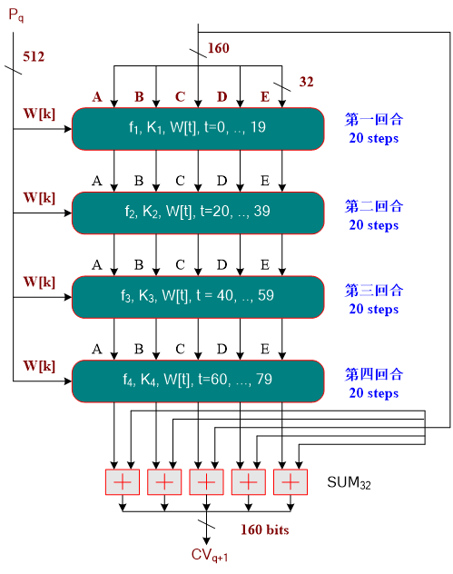
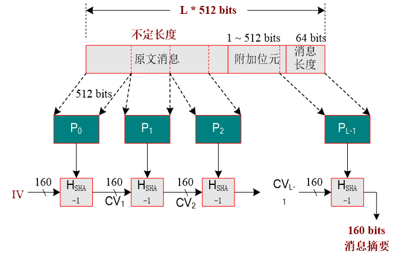

### definition

SHA1算法的输入是最大长度小于264bit的消息，输入消息以512bit的分组为单位处理，输出是160bit的消息摘要。SHA1对“任意”长度的消息生成160bit的消息摘要（MD5仅仅生成128位的摘要），因此抗穷举性更好。

RFC文档：[US Secure Hash Algorithm 1 (SHA1)](<https://tools.ietf.org/html/rfc3174>)

### principle

SHA1 的压缩函数，包含轮循环的模块，每轮循环由20个步骤组成，其逻辑图如下图所示。

#### 附加位填充

填充一个“1”和若干个“0”使其长度模512与448同余。然后在消息后附加64比特的无符号整数，其值为原始消息的长度。最后消息串的长度为512整数倍。处理流程如下图所示。

改进：

- 将消息以512比特为单位进行分组，最后一组需要进行填充，前面的可以直接进行压缩处理。

- 1)  当最后一组长度 <= 448比特时，填充一个“1”和若干个“0”使其长度为448比特；

  2)  当最后一组长度 > 448 比特时，填充一个“1”和若干个“0”使其长度为512比特，将这一组进行压缩处理，再加一组，填充448比特“0”；

- 在最后一组的最后64比特填上原始消息的长度，进行压缩处理。

 

#### 步函数

SHA1每运行一次步函数，寄存器A、B、C、D的值顺序赋值给（或经过一个简单左循环移位后）B、C、D、E寄存器。同时，A、B、C、D、E的输入值与常数和子消息块经过步函数运算后赋值给A。

其中，t是步数，r是轮数，1<=r<=4，S30表示B循环左移30位。

Kr  是轮常数。

| 步数  | Kr |
| :---: | :-----------: |
| r = 1 |  0x5A827999   |
| r = 2 |  0x6ED9EBA1   |
| r = 3 |  0x8F1BBCDC   |
| r = 4 |  0xCA62C1D6   |

fr 是非线性函数。

W[t] 是32比特消息字。

步函数流程如图3-3所示

